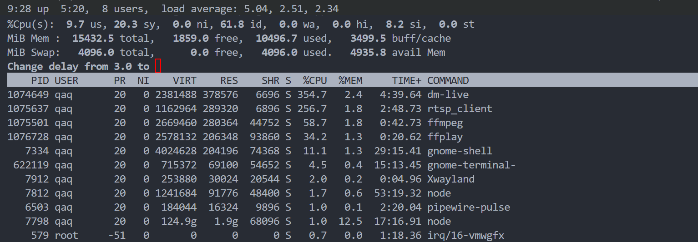
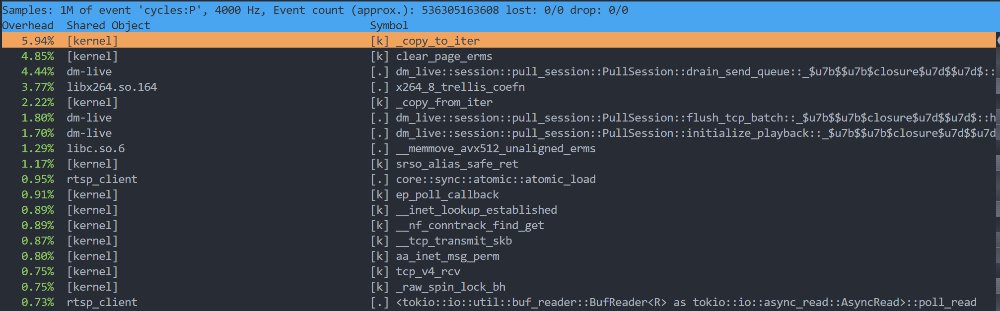

# Pull Performance Test (20k Concurrency @ 20Gbps)

## Summary
In a VM environment handling 20k concurrent pull streams at 20 Gbps bandwidth, CPU usage is about 3.5 CPU cores and memory usage is about 370 MB RAM.

## Environment

* **OS**: Ubuntu 25.04
* **CPU**: AMD Ryzen 9 7940HX with Radeon Graphics @ 2.4GHz, 16 vCores
* **Virtualization**: VMware Virtual Platform
* **RAM**: 16 GB
* **Network**: Loopback Interface
### Test Method
1. Use ffmpeg to push a 928 kb/s H.264/AAC stream to the local RTSP server.
2. Use `rtsp_client` to pull that RTSP stream and simulate 20k concurrent connections.

### Data
| Metric            | Value               |
|-------------------|---------------------|
| Concurrency       | 20,000 connections  |
| Bandwidth         | ~20 Gbps            |
| CPU Usage         | ~355%               |
|Throughput per Core | ~5.6 GBit/s/Core   |
| Memory Usage      | ~370 MB             |
|Memory per Connection| ~19 KB/Connection  |


### Push Command
```bash
ffmpeg -re -stream_loop -1 -i ./test.mp4 -c:v libx264 -c:a aac -f rtsp -rtsp_transport tcp rtsp://127.0.0.1:9090/app/streamp
```

### 20k Pulls
```bash
cargo run --example rtsp_client rtsp://127.0.0.1:9090/app/streamp tcp 20000
```


<details>

<summary>Video Info</summary>
```bash
[mov,mp4,m4a,3gp,3g2,mj2 @ 0x58f465ef4e80] stream 0, timescale not set
Input #0, mov,mp4,m4a,3gp,3g2,mj2, from './test.mp4':
  Metadata:
    major_brand     : isom
    minor_version   : 1
    compatible_brands: isom
    creation_time   : 2011-11-28T18:25:40.000000Z
    podcast         : 1
    media_type      : 0
    title           : TED: 911 Mothers (2010 Women)
    artist          : TED
    date            : 2010
    album           : TEDTalks
    comment         : To learn more about this speaker, find other TEDTalks, and subscribe to this Podcast series, visit www.TED.com
                    : Feedback: contact@ted.com
    genre           : Podcast
    category        : Higher Education
  Duration: 00:09:54.01, start: 0.000000, bitrate: 928 kb/s
  Stream #0:0[0x1](und): Video: h264 (Main) (avc1 / 0x31637661), yuv420p(progressive), 854x480 [SAR 1280:1281 DAR 16:9], 851 kb/s, 30 fps, 30 tbr, 30 tbn (default)
      Metadata:
        creation_time   : 2011-08-05T17:27:20.000000Z
        handler_name    : VideoHandler
        vendor_id       : [0][0][0][0]
  Stream #0:1[0x2](und): Audio: aac (LC) (mp4a / 0x6134706D), 44100 Hz, stereo, fltp, 72 kb/s (default)
      Metadata:
        creation_time   : 2011-11-28T18:25:41.000000Z
        handler_name    : GPAC ISO Audio Handler
        vendor_id       : [0][0][0][0]
  Stream #0:2[0x0]: Video: png, pal8(pc, gbr/unknown/unknown), 400x400, 90k tbr, 90k tbn (attached pic)
```
</details>

### Observations
##### TOP


##### Nload


##### perf top


##### Latency and Response
All measurements were taken with 20k concurrent pulls.
```bash
time ffprobe -v error -rtsp_transport tcp -select_streams v:0 -show_packets -count_packets 1 rtsp://127.0.0.1:9090/app/streamp

real    0m0.073s
user    0m0.023s
sys     0m0.039s
```

```bash
ffmpeg -rtsp_transport tcp -i rtsp://127.0.0.1:9090/app/streamp -f null -

frame=  383 fps= 38 q=-0.0 Lsize=N/A time=00:00:12.83 bitrate=N/A speed=1.27x
```
